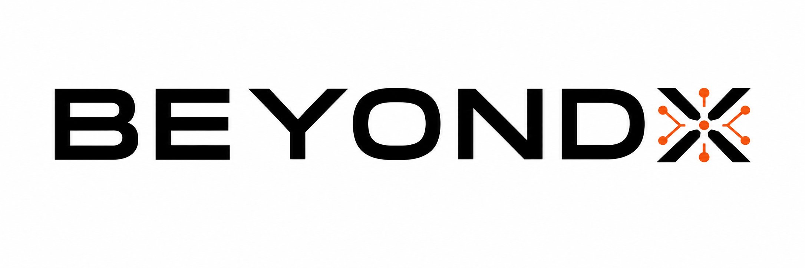

<div align="center">

<br/>



<br/>

### **AI Marketing Era**

*Entire marketing team. Autonomous. Intelligent. Always on.*

<br/>


<br/>

> **BeyondX delivers the work of an entire marketing agency at a fraction of the cost,**
> **powered by an autonomous AI workforce.**

<br/>

</div>

---

## What is BeyondX?

**BeyondX** is an **Autonomous AI Marketing Team** — a multi-agent platform that replaces the need for a traditional marketing agency.

Instead of hiring researchers, strategists, branding experts, and content teams separately, users interact with a single platform that executes the entire marketing workflow — autonomously, continuously, and at scale.

BeyondX is built around **two phases**, each deployable independently or together:

| Phase | What It Does 
|---|---|
**Phase One — AI Brand Builder** | Transforms a business idea into a full, market-ready brand |
**Phase Two — AI Content Creator** | Operates as a persistent AI marketing brain for ongoing campaigns and content |

---

## About

BeyondX replaces the entire agency model with an **autonomous, multi-agent AI workforce**.

| Traditional Agency | BeyondX |
|---|---|
| Market Research Team | Market Research Agent |
| Strategy Consultants | Go-to-Market Strategy Agent |
| Branding Studio | Brand Book + Brand Identity Agent |
| Naming Consultants | Brand Naming Agent |
| Web Designers | Web Builder Agent |
| Content Team | AI Content Creator |
| Campaign Managers | Campaign Generation Engine |
| Trend Analysts | Real-Time Trend Intelligence |


---

## Architecture

BeyondX is built on a **LangGraph-powered multi-agent orchestration framework**, where each agent is a specialized node with defined inputs, outputs, and responsibilities.

```
USER INPUT
    │
    ▼
┌─────────────────────────────────────────┐
│         PHASE ONE: AI Brand Builder     │
│                                         │
│  Market Research → Analyst → Strategy   │
│       → Naming → Brand Book             │
│    → Brand Identity → Web Builder       │
│                                         │
│           Market-Ready Brand            │
└──────────────────┬──────────────────────┘
         Brand Identity Feed

USER INPUT
    │
    ▼            
┌─────────────────────────────────────────┐
│  PHASE TWO: AI Content Creator (Chat)   │
│                                         │
│   Brand Memory  ←→  Trend Intelligence  │
│              ↓                          │
│   Campaign Engine  │  Content Generator │
│              ↓                          │
│  Posts · Reels · Campaigns · Calendars  │
└─────────────────────────────────────────┘
```

---

## Phase One — AI Brand Builder

Seven autonomous agents work in sequence to turn a raw idea into a complete brand.

| # | Agent | Outputs |
|---|---|---|
| 1 | **Market Research** | Market Insights, Competitor Landscape, Opportunity Report |
| 2 | **Analyst** | Positioning Map, White Space Analysis, Competitive Intelligence |
| 3 | **Go-to-Market Strategy** | Strategic Roadmap, Launch Strategy, Growth Plan |
| 4 | **Brand Naming** | Brand Name Options, Naming Strategy, Domain Suggestions |
| 5 | **Brand Identity** | Mission, Vision, Core Values, Brand Voice, Personality |
| 6 | **Brand Book** | Logo Direction, Color Palette, Typography, Identity Guidelines |
| 7 | **Web Builder** | Landing Page Blueprint, Website Copy, Wireframes |

---

## Phase Two — AI Content Creator

An **independent product** inside BeyondX — usable without Phase One. It operates as a persistent AI marketing brain that remembers everything about your brand.

**At onboarding, you provide:**

| Input | Purpose |
|---|---|
| Brand Name & Description | Core identity |
| Location | Geographic & market context |
| Target Audience | Customer demographics |
| Brand Founding Date | Enables anniversary & milestone intelligence |
| Platforms | For Content creation and Posts |

**The system permanently stores and manages:**

- Brand Story & Voice
- Customer Segments & Marketing Goals
- Previous Campaigns & Content
- Seasonal Opportunities

> **You never repeat yourself. Every session continues from where the last one ended.**

### Content Generation

| Platform | Content Types |
|---|---|
| **Facebook** | Posts, Campaign Copy, Engagement Content |
| **Instagram** | Captions, Reels Scripts, Stories |
| **LinkedIn** | Thought Leadership, Announcements, B2B Copy |
| **TikTok** | Hooks, Scripts, Trend-Aligned Content |
| **X (Twitter)** | Threads, Posts, Reactive Content |

### Campaign Types

`Awareness` · `Engagement` · `Product Launch` · `Seasonal` · `Promotional` · `Retention`

Each campaign includes an objective, audience, key message, content ideas, posting schedule, and CTA strategy.

---

## Project structure

```
agents/           # Stage agents (research, naming, brand book, etc.)
nodes/            # LangGraph nodes for each pipeline stage
content_gen_agent/  # Content Creator chatbot agent
api/              # FastAPI app and routers
frontend/         # React frontend
config/           # Settings, LLM factory
brand_packs/      # Generated brand outputs (gitignored)
```

---

## Running locally

**Terminal 1 — API:**
```bash
source venv/bin/activate
python api/run.py
```
Runs on `http://localhost:8000`

**Terminal 2 — Frontend:**
```bash
cd frontend
npm run dev
```
Runs on `http://localhost:5173`

---

## Roadmap

| Status | Feature |
|---|---|
| ✅ | Phase One — AI Brand Builder |
| ✅ | Phase Two — AI Content Creator |
| ✅ | Persistent Memory Integration |
| ✅ | Real-Time Trend Intelligence |

---

## Founders

<div align="center">

| **Hana Haridy** | **Mohamed Halim** |
|:---:|:---:|
| Co-Founder | Co-Founder |

<br/>

*"We built BeyondX because we believe every business deserves enterprise-level marketing intelligence, not just the ones that can afford an agency."*

</div>

---

## License

This project is licensed under the **MIT License** — see the [LICENSE](LICENSE) file for details.

---

<div align="center">

**BeyondX delivers the work of an entire marketing agency at a fraction of the cost, powered by an autonomous AI workforce.**

<br/>


<br/>

*© 2026 BeyondX. All rights reserved.*

</div>
